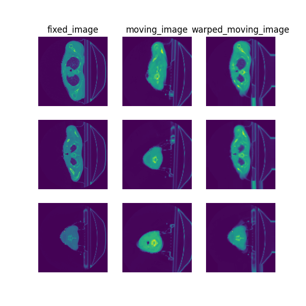

# Classical affine registration for head-and-neck CT images

> **Note**: Please read the
> [DeepReg Demo Disclaimer](introduction.html#demo-disclaimer).

[Source Code](https://github.com/DeepRegNet/DeepReg/tree/main/demos/classical_ct_headneck_affine)

This is a special demo that uses the DeepReg package for classical affine image
registration, which iteratively solves an optimisation problem. Gradient descent is used
to minimise the image dissimilarity function of a given pair of moving anf fixed images.

## Author

DeepReg Development Team

## Application

Although in this demo the moving images are simulated using a randomly generated
transformation. The registration technique can be used in radiotherapy to compensate the
difference between CT acquired at different time points, such as pre-treatment and
intra-/post-treatment.

## Data

Data is
[an example CT volume](https://wiki.cancerimagingarchive.net/display/Public/Head-Neck-PET-CT)
with two labels.

## Instruction

### Installation

Please install DeepReg following the [instructions](../getting_started/install.html) and
change the current directory to the root directory of DeepReg project, i.e. `DeepReg/`.

### Download data

Please execute the following command to download and pre-process the data.

```bash
python demos/classical_ct_headneck_affine/demo_data.py
```

### Launch registration

Please execute the following command to register two images. The fixed image will be the
downloaded data and the moving image will be simulated by applying a random affine
transformation, such that the ground-truth is available for. The optimised
transformation will be applied to the moving images, as well as the moving labels. The
results, saved in a timestamped folder under the project directory, will compare the
warped image/labels with the ground-truth image/labels.

```bash
python demos/classical_ct_headneck_affine/demo_register.py
```

## Visualise

The following command can be executed to generate a plot of three image slices from the
the moving image, warped image and fixed image (left to right) to visualise the
registration. Please see the visualisation tool docs
[here](https://github.com/DeepRegNet/DeepReg/blob/main/docs/source/docs/visualisation_tool.md)
for more visualisation options such as animated gifs.

```bash
deepreg_vis -m 2 -i 'demos/classical_ct_headneck_affine/logs_reg/moving_image.nii.gz, demos/classical_ct_headneck_affine/logs_reg/warped_moving_image.nii.gz, demos/classical_ct_headneck_affine/logs_reg/fixed_image.nii.gz' --slice-inds '4,8,12' -s demos/classical_ct_headneck_affine/logs_reg
```

Note: The registration script must be run before running the command to generate the
visualisation.



## Contact

Please [raise an issue](https://github.com/DeepRegNet/DeepReg/issues/new/choose) for any
questions.

## Reference

[1] Vallières, M. et al. Radiomics strategies for risk assessment of tumour failure in
head-and-neck cancer. Sci Rep 7, 10117 (2017). doi: 10.1038/s41598-017-10371-5
