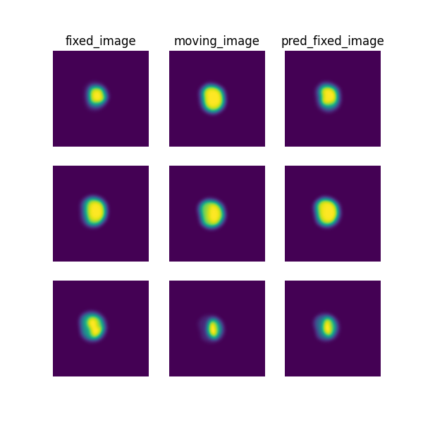

# Pairwise registration for grouped prostate segmentation masks

> **Note**: Please read the
> [DeepReg Demo Disclaimer](introduction.html#demo-disclaimer).

[Source Code](https://github.com/DeepRegNet/DeepReg/tree/main/demos/grouped_mask_prostate_longitudinal)

This demo uses DeepReg to demonstrate a number of features:

- For grouped data in h5 files, e.g. "group-1-2" indicates the 2th visit from Subject 1;
- Use masks as the images for feature-based registration - aligning the prostate gland
  segmentation in this case - with deep learning;
- Register intra-patient longitudinal data.

This demo also implements the feature-based registration described in
[Morphological Change Forecasting for Prostate Glands using Feature-based Registration and Kernel Density Extrapolation](https://arxiv.org/abs/2101.06425).

## Author

DeepReg Development Team

## Application

Longitudinal registration detects the temporal changes and normalises the spatial
difference between images acquired at different time-points. For prostate cancer
patients under active surveillance programmes, quantifying these changes is useful for
detecting and monitoring potential cancerous regions.

## Data

This is a demo without real clinical data due to regulatory restrictions. The MR and
ultrasound images used are simulated dummy 3D Ultrasound images. Data are organized into
10 separate folds.

## Instruction

### Installation

Please install DeepReg following the [instructions](../getting_started/install.html) and
change the current directory to the root directory of DeepReg project, i.e. `DeepReg/`.

### Download data

Please execute the following command to download/pre-process the data and download the
pre-trained model.

```bash
python demos/grouped_mask_prostate_longitudinal/demo_data.py
```

### Launch demo training

Please execute the following command to launch a demo training (the first of the ten
runs of a 9-fold cross-validation). The training logs and model checkpoints will be
saved under `demos/grouped_mask_prostate_longitudinal/logs_train`.

```bash
python demos/grouped_mask_prostate_longitudinal/demo_train.py
```

Here the training is launched using the GPU of index 0 with a limited number of steps
and reduced size. Please add flag `--full` to use the original training configuration,
such as

```bash
python demos/grouped_mask_prostate_longitudinal/demo_train.py --full
```

### Predict

Please execute the following command to run the prediction with pre-trained model. The
prediction logs and visualization results will be saved under
`demos/grouped_mask_prostate_longitudinal/logs_predict`. Check the
[CLI documentation](../docs/cli.html) for more details about prediction output.

```bash
python demos/grouped_mask_prostate_longitudinal/demo_predict.py
```

Optionally, the user-trained model can be used by changing the `ckpt_path` variable
inside `demo_predict.py`. Note that the path should end with `.ckpt` and checkpoints are
saved under `logs_train` as mentioned above.

## Visualise

The following command can be executed to generate a plot of three image slices from the
the moving image, warped image and fixed image (left to right) to visualise the
registration. Please see the visualisation tool docs
[here](https://github.com/DeepRegNet/DeepReg/blob/main/docs/source/docs/visualisation_tool.md)
for more visualisation options such as animated gifs.

```bash
deepreg_vis -m 2 -i 'demos/grouped_mask_prostate_longitudinal/logs_predict/<time-stamp>/test/<pair-number>/moving_image.nii.gz, demos/grouped_mask_prostate_longitudinal/logs_predict/<time-stamp>/test/<pair-number>/pred_fixed_image.nii.gz, demos/grouped_mask_prostate_longitudinal/logs_predict/<time-stamp>/test/<pair-number>/fixed_image.nii.gz' --slice-inds '10,16,20' -s demos/grouped_mask_prostate_longitudinal/logs_predict
```

Note: The prediction must be run before running the command to generate the
visualisation. The `<time-stamp>` and `<pair-number>` must be entered by the user.



## Contact

Please [raise an issue](https://github.com/DeepRegNet/DeepReg/issues/new/choose) for any
questions.
