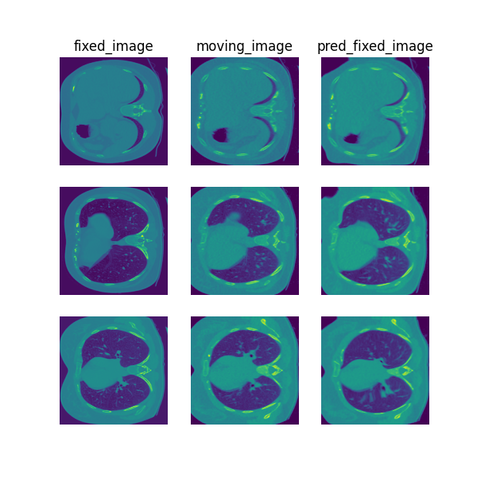

# Paired lung CT registration

> **Note**: Please read the
> [DeepReg Demo Disclaimer](introduction.html#demo-disclaimer).

[Source Code](https://github.com/DeepRegNet/DeepReg/tree/main/demos/paired_ct_lung)

## Author

DeepReg Development Team (Shaheer Saeed)

## Application

This is a registration between CT images acquired at different time points for a single
patient. The images being registered are taken at inspiration and expiration for each
subject. This is an intra subject registration. This type of intra subject registration
is useful when there is a need to track certain features on a medical image such as
tumor location when conducting invasive procedures.

## Data

The dataset for this demo comes from
[Lean2Reg Challenge: CT Lung Registration - Training Data](https://zenodo.org/record/3835682#.XsUWXsBpFhE)
[1].

## Instruction

### Installation

Please install DeepReg following the [instructions](../getting_started/install.html) and
change the current directory to the root directory of DeepReg project, i.e. `DeepReg/`.

### Download data

Please execute the following command to download/pre-process the data and download the
pre-trained model. Image intensities are rescaled during pre-processing.

```bash
python demos/paired_ct_lung/demo_data.py
```

### Launch demo training

Please execute the following command to launch a demo training. The training logs and
model checkpoints will be saved under `demos/paired_ct_lung/logs_train`.

```bash
python demos/paired_ct_lung/demo_train.py
```

Here the training is launched using the GPU of index 0 with a limited number of steps
and reduced size. Please add flag `--full` to use the original training configuration,
such as

```bash
python demos/paired_ct_lung/demo_train.py --full
```

### Predict

Please execute the following command to run the prediction with pre-trained model. The
prediction logs and visualization results will be saved under
`demos/paired_ct_lung/logs_predict`. Check the [CLI documentation](../docs/cli.html) for
more details about prediction output.

```bash
python demos/paired_ct_lung/demo_predict.py
```

Optionally, the user-trained model can be used by changing the `ckpt_path` variable
inside `demo_predict.py`. Note that the path should end with `.ckpt` and checkpoints are
saved under `logs_train` as mentioned above.

## Visualise

The following command can be executed to generate a plot of three image slices from the
the moving image, warped image and fixed image (left to right) to visualise the
registration. Please see the visualisation tool docs
[here](https://github.com/DeepRegNet/DeepReg/blob/main/docs/source/docs/visualisation_tool.md)
for more visualisation options such as animated gifs.

```bash
deepreg_vis -m 2 -i 'demos/paired_ct_lung/logs_predict/<time-stamp>/test/<pair-number>/moving_image.nii.gz, demos/paired_ct_lung/logs_predict/<time-stamp>/test/<pair-number>/pred_fixed_image.nii.gz, demos/paired_ct_lung/logs_predict/<time-stamp>/test/<pair-number>/fixed_image.nii.gz' --slice-inds '64,50,72' -s demos/paired_ct_lung/logs_predict/
```

Note: The prediction must be run before running the command to generate the
visualisation. The `<time-stamp>` and `<pair-number>` must be entered by the user.



## Contact

Please [raise an issue](https://github.com/DeepRegNet/DeepReg/issues/new/choose) for any
questions.

## Reference

[1] Hering, Alessa, Murphy,Keelin, and van Ginneken, Bram. (2020). Lean2Reg Challenge:
CT Lung Registration : CT Lung Registration - Training Data
