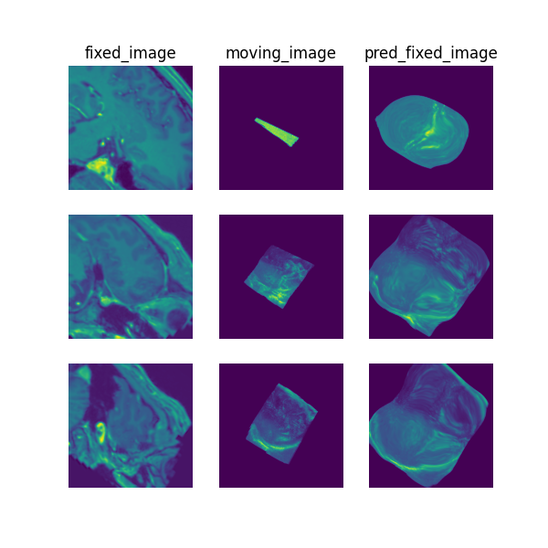

# Paired brain MR-ultrasound registration

> **Note**: Please read the
> [DeepReg Demo Disclaimer](introduction.html#demo-disclaimer).

> **Warning**:
> [This demo ought to be improved in the future.](https://github.com/DeepRegNet/DeepReg/issues/620).

[Source Code](https://github.com/DeepRegNet/DeepReg/tree/main/demos/paired_mrus_brain)

## Author

DeepReg Development Team (Shaheer Saeed)

## Application

This demo aims to register pairs of brain MR and ultrasound scans. The dataset consists
of 22 subjects with low-grade brain gliomas who underwent brain tumour resection [1].
The main application for this type of registration is to better delineate brain tumour
boundaries during surgery and correct tissue shift induced by the craniotomy.

## Data

The dataset for this demo comes from Xiao et al. [1] and can be downloaded from:
https://archive.sigma2.no/pages/public/datasetDetail.jsf?id=10.11582/2020.00025.

## Instruction

Please install DeepReg following the [instructions](../getting_started/install.html) and
change the current directory to the root directory of DeepReg project, i.e. `DeepReg/`.

### Download data

Please execute the following command to download/pre-process the data and download the
pre-trained model. By default, the downloaded data is only a partial of the original
one. However the access to the original data is temporarily unavailable.

```bash
python demos/paired_mrus_brain/demo_data.py
```

### Launch demo training

Please execute the following command to launch a demo training. The training logs and
model checkpoints will be saved under `demos/paired_mrus_brain/logs_train`.

```bash
python demos/paired_mrus_brain/demo_train.py
```

Here the training is launched using the GPU of index 0 with a limited number of steps
and reduced size. Please add flag `--full` to use the original training configuration,
such as

```bash
python demos/paired_mrus_brain/demo_train.py --full
```

Note: The number of epochs and reduced dataset size for training will result in a loss
in test accuracy so please train with the full dataset and for a greater number of
epochs for improved results.

### Predict

Please execute the following command to run the prediction with pre-trained model. The
prediction logs and visualization results will be saved under
`demos/paired_mrus_brain/logs_predict`. Check the [CLI documentation](../docs/cli.html)
for more details about prediction output.

```bash
python demos/paired_mrus_brain/demo_predict.py
```

Optionally, the user-trained model can be used by changing the `ckpt_path` variable
inside `demo_predict.py`. Note that the path should end with `.ckpt` and checkpoints are
saved under `logs_train` as mentioned above.

## Visualise

The following command can be executed to generate a plot of three image slices from the
the moving image, warped image and fixed image (left to right) to visualise the
registration. Please see the visualisation tool docs
[here](https://github.com/DeepRegNet/DeepReg/blob/main/docs/source/docs/visualisation_tool.md)
for more visualisation options such as animated gifs.

```bash
deepreg_vis -m 2 -i 'demos/paired_mrus_brain/logs_predict/<time-stamp>/test/<pair-number>/moving_image.nii.gz, demos/paired_mrus_brain/logs_predict/<time-stamp>/test/<pair-number>/pred_fixed_image.nii.gz, demos/paired_mrus_brain/logs_predict/<time-stamp>/test/<pair-number>/fixed_image.nii.gz' --slice-inds '190,128,96' -s demos/paired_mrus_brain/logs_predict
```

Note: The prediction must be run before running the command to generate the
visualisation. The `<time-stamp>` and `<pair-number>` must be entered by the user.



## Contact

Please [raise an issue](https://github.com/DeepRegNet/DeepReg/issues/new/choose) for any
questions.

## Reference

[1] Y. Xiao, M. Fortin, G. Unsgård , H. Rivaz, and I. Reinertsen, "REtroSpective
Evaluation of Cerebral Tumors (RESECT): a clinical database of pre-operative MRI and
intra-operative ultrasound in low-grade glioma surgeries". Medical Physics, Vol. 44(7),
pp. 3875-3882, 2017.
