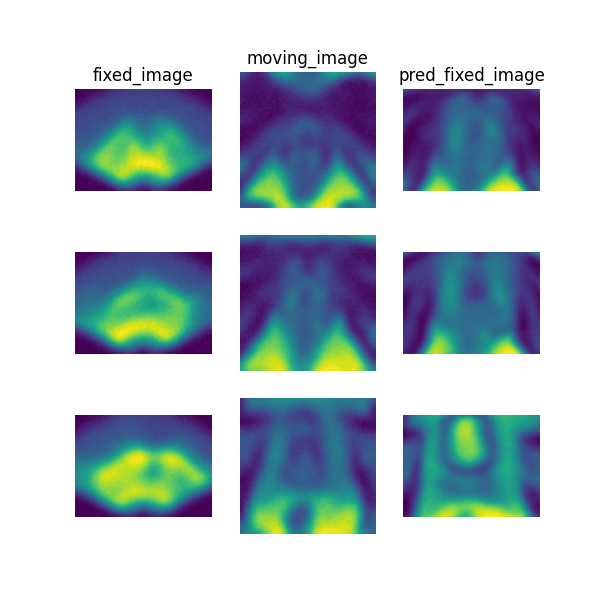

# Paired prostate MR-ultrasound registration

> **Note**: Please read the
> [DeepReg Demo Disclaimer](introduction.html#demo-disclaimer).

> **Warning**:
> [This demo ought to be improved in the future.](https://github.com/DeepRegNet/DeepReg/issues/621).

[Source Code](https://github.com/DeepRegNet/DeepReg/tree/main/demos/paired_mrus_brain)

This demo uses DeepReg to re-implement the algorithms described in
[Weakly-supervised convolutional neural networks for multimodal image registration](https://doi.org/10.1016/j.media.2018.07.002).
A standalone demo was hosted at https://github.com/yipenghu/label-reg.

## Author

DeepReg Development Team

## Application

Registering preoperative MR images to intraoperative transrectal ultrasound images has
been an active research area for more than a decade. The multimodal image registration
task assist a number of ultrasound-guided interventions and surgical procedures, such as
targeted biopsy and focal therapy for prostate cancer patients. One of the key
challenges in this registration task is the lack of robust and effective similarity
measures between the two image types. This demo implements a weakly-supervised learning
approach to learn voxel correspondence between intensity patterns between the multimodal
data, driven by expert-defined anatomical landmarks, such as the prostate gland
segmentaion.

## Data

This is a demo without real clinical data due to regulatory restrictions. The MR and
ultrasound images used are simulated dummy images.

## Instruction

### Installation

Please install DeepReg following the [instructions](../getting_started/install.html) and
change the current directory to the root directory of DeepReg project, i.e. `DeepReg/`.

### Download data

Please execute the following command to download/pre-process the data and download the
pre-trained model.

```bash
python demos/paired_mrus_prostate/demo_data.py
```

### Launch demo training

Please execute the following command to launch a demo training (the first of the ten
runs of a 9-fold cross-validation). The training logs and model checkpoints will be
saved under `demos/paired_mrus_prostate/logs_train`.

```bash
python demos/paired_mrus_prostate/demo_train.py
```

Here the training is launched using the GPU of index 0 with a limited number of steps
and reduced size. Please add flag `--full` to use the original training configuration,
such as

```bash
python demos/paired_mrus_prostate/demo_train.py --full
```

### Predict

Please execute the following command to run the prediction with pre-trained model. The
prediction logs and visualization results will be saved under
`demos/paired_mrus_prostate/logs_predict`. Check the
[CLI documentation](../docs/cli.html) for more details about prediction output.

```bash
python demos/paired_mrus_prostate/demo_predict.py
```

Optionally, the user-trained model can be used by changing the `ckpt_path` variable
inside `demo_predict.py`. Note that the path should end with `.ckpt` and checkpoints are
saved under `logs_train` as mentioned above.

## Visualise

The following command can be executed to generate a plot of three image slices from the
the moving image, warped image and fixed image (left to right) to visualise the
registration. Please see the visualisation tool docs
[here](https://github.com/DeepRegNet/DeepReg/blob/main/docs/source/docs/visualisation_tool.md)
for more visualisation options such as animated gifs.

```bash
deepreg_vis -m 2 -i 'demos/paired_mrus_prostate/logs_predict/<time-stamp>/test/<pair-number>/moving_image.nii.gz, demos/paired_mrus_prostate/logs_predict/<time-stamp>/test/<pair-number>/pred_fixed_image.nii.gz, demos/paired_mrus_prostate/logs_predict/<time-stamp>/test/<pair-number>/fixed_image.nii.gz' --slice-inds '12,20,36' -s demos/paired_mrus_prostate/logs_predict
```

Note: The prediction must be run before running the command to generate the
visualisation. The `<time-stamp>` and `<pair-number>` must be entered by the user.



## Contact

Please [raise an issue](https://github.com/DeepRegNet/DeepReg/issues/new/choose) for any
questions.
