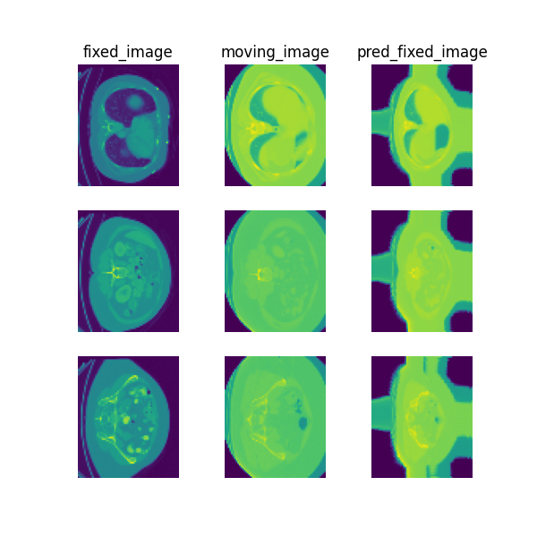

# Unpaired abdomen CT registration

> **Note**: Please read the
> [DeepReg Demo Disclaimer](introduction.html#demo-disclaimer).

> **Warning**:
> [This demo ought to be improved in the future.](https://github.com/DeepRegNet/DeepReg/issues/552).

[Source Code](https://github.com/DeepRegNet/DeepReg/tree/main/demos/unpaired_ct_abdomen)

## Author

DeepReg Development Team (Ester Bonmati)

## Application

This demo shows how to register unpaired abdominal CT data from different patients using
DeepReg. In addition, the demo demonstrates the difference between the unsupervised,
weakly-supervised and their combination, using a U-Net.

## Data

The data set is from the MICCAI Learn2Reg grand challenge
(https://learn2reg.grand-challenge.org/) task 3 [1], and can be downloaded directly from
https://learn2reg.grand-challenge.org/Datasets/.

## Instruction

### Installation

Please install DeepReg following the [instructions](../getting_started/install.html) and
change the current directory to the root directory of DeepReg project, i.e. `DeepReg/`.

### Download data

Please execute the following command to download/pre-process the data and download the
pre-trained model.

```bash
python demos/unpaired_ct_abdomen/demo_data.py
```

### Launch demo training

In this demo, three different training methods are provided: unsupervised, weakly
supervised and the combined method. Please execute one of the following commands to
launch a demo training. The training logs and model checkpoints will be saved under
`demos/unpaired_ct_abdomen/logs_train/method` with `method` be `unsup`, `weakly` or
`comb`.

```bash
python demos/unpaired_ct_abdomen/demo_train.py --method unsup
python demos/unpaired_ct_abdomen/demo_train.py --method weakly
python demos/unpaired_ct_abdomen/demo_train.py --method comb
```

Here the training is launched using the GPU of index 0 with a limited number of steps
and reduced size. Please add flag `--full` to use the original training configuration,
such as

```bash
python demos/unpaired_ct_abdomen/demo_train.py --method unsup --full
```

### Predict

Please execute one of the following commands to run the prediction with pre-trained
model. The prediction logs and visualization results will be saved under
`demos/unpaired_ct_abdomen/logs_predict/method` with `method` be `unsup`, `weakly` or
`comb`. Check the [CLI documentation](../docs/cli.html) for more details about
prediction output.

```bash
python demos/unpaired_ct_abdomen/demo_predict.py --method unsup
python demos/unpaired_ct_abdomen/demo_predict.py --method weakly
python demos/unpaired_ct_abdomen/demo_predict.py --method comb
```

Optionally, the user-trained model can be used by changing the `ckpt_path` variable
inside `demo_predict.py`. Note that the path should end with `.ckpt` and checkpoints are
saved under `logs_train` as mentioned above.

## Visualise

The following command can be executed to generate a plot of three image slices from the
the moving image, warped image and fixed image (left to right) to visualise the
registration. Please see the visualisation tool docs
[here](https://github.com/DeepRegNet/DeepReg/blob/main/docs/source/docs/visualisation_tool.md)
for more visualisation options such as animated gifs.

```bash
deepreg_vis -m 2 -i 'demos/unpaired_ct_abdomen/logs_predict/comb/<time-stamp>/test/<pair-number>/moving_image.nii.gz, demos/unpaired_ct_abdomen/logs_predict/comb/<time-stamp>/test/<pair-number>/pred_fixed_image.nii.gz, demos/unpaired_ct_abdomen/logs_predict/comb/<time-stamp>/test/<pair-number>/fixed_image.nii.gz' --slice-inds '30,50,65' -s demos/unpaired_ct_abdomen/logs_predict
```

Note: The prediction must be run before running the command to generate the
visualisation. The `<time-stamp>` and `<pair-number>` must be entered by the user.



## Contact

Please [raise an issue](https://github.com/DeepRegNet/DeepReg/issues/new/choose) for any
questions.

## Reference

[1] Adrian Dalca, Yipeng Hu, Tom Vercauteren, Mattias Heinrich, Lasse Hansen, Marc
Modat, Bob de Vos, Yiming Xiao, Hassan Rivaz, Matthieu Chabanas, Ingerid Reinertsen,
Bennett Landman, Jorge Cardoso, Bram van Ginneken, Alessa Hering, and Keelin Murphy.
(2020, March 19). Learn2Reg - The Challenge. Zenodo.
http://doi.org/10.5281/zenodo.3715652
