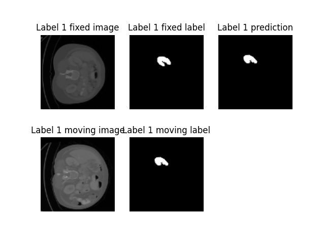

# Unpaired CT Abdominal Registration

## Author

Ester Bonmati (e.bonmati@ucl.ac.uk)

## Application

This demo shows how to register unpaired CT data from the abdomen using DeepReg (unlabeled and labeled).
The data that this demo uses is from the MICCAI Learn2Reg grand challenge (https://learn2reg.grand-challenge.org/) task 3 [1].

## Requirements

This demo requires to have installed DeepReg.

## Instructions

1.- Go to the root directory DeepReg.

2.- Run demo_data.py to download and extract all files, and to split the data in training, validation and testing. If the data has already been downloaded, you can skip the download.

```
python ./demos/unpaired_ct_abdomen/demo_data.py  
```

After running the command you will have the following directories in DeepReg/demos/unpaired_ct_abdomen/dataset:

```
DeepReg$ ls demos/unpaired_ct_abdomen/dataset/

L2R_Task3_AbdominalCT.tar  test  train  valid
```
Where L2R_Task3_AbdominalCT.tar is the dataset that has been downloaded, test is a folder that contains the images and labels for testing, train is a folder that contains the images and labels for training, and valid is a folder that contains the images and labels for validation.

3.- The next step is to train the network using DeepReg. To train the network, run demo_train.py:

```
DeepReg$ python ./demos/unpaired_ct_abdomen/demo_train.py   
```

4.- After training the network, run demo_predict:

```
DeepReg$ python ./demos/unpaired_ct_abdomen/demo_predict.py   
```

5.- Finally, if you want to see the result of predict with the images in testing, run demo_plot:

```
DeepReg$ python ./demos/unpaired_ct_abdomen/demo_plot.py   
```
You will find the following images with the results of the prediction in DeepReg/logs/unpaired_ct_abdomen_log/plot:

<p align="center">
	
</p>

<p align="center">
	
</p>

## Pre-trained Model
 
A pre-trained model is also available. 


## Data

The dataset for this demo is part of the Learn2Reg challenge (task 3) [1] and can be downloaded from:

https://learn2reg.grand-challenge.org/Datasets/


## Tested DeepReg Version

??

## References

[1] Adrian Dalca, Yipeng Hu, Tom Vercauteren, Mattias Heinrich, Lasse Hansen, Marc Modat, Bob de Vos, Yiming Xiao, Hassan Rivaz, Matthieu Chabanas, Ingerid Reinertsen, Bennett Landman, Jorge Cardoso, Bram van Ginneken, Alessa Hering, and Keelin Murphy. (2020, March 19). Learn2Reg - The Challenge. Zenodo. http://doi.org/10.5281/zenodo.3715652