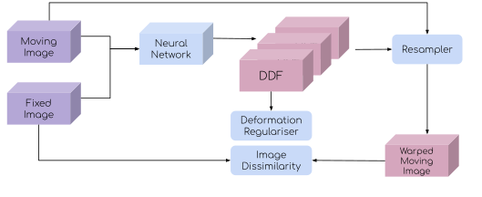
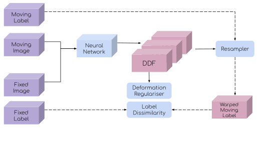
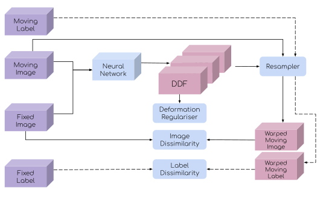

# Summary
Image fusion is a fundamental task in medical image analysis and computer-assisted intervention. Medical image registration, computational algorithms that align different images together [@hill2001medical], has in recent years turned the research attention towards deep learning. Indeed, the representation ability to learn from population data with deep neural networks has opened new possibilities for improving registration accuracy and generalisation by mitigating difficulties in designing hand-engineered image features and similarity measures for many real-world clinical applications [@haskins2020deep; @fu2020deep]. In addition, the fast inference with deep neural networks can substantially accelerate registration execution for time-critical tasks such as those in surgery and intervention.

However, popular packages focusing on deep learning methods for medical imaging, such as NiftyNet [@gibson2018niftynet] and MONAI (https://monai.io/), do not yet support image registration, while other open-source projects implementing specific published algorithms, such as the VoxelMorph [@balakrishnan2019voxelmorph], are seldom tested or designed for general research and education purposes.

*DeepReg* is a Python package that implements a class of image registration algorithms based on deep neural networks. Both unsupervised algorithms [@de2019deep] and weakly-supervised algorithms [@hu2018label] have been re-implemented. At the core of this framework is combining unsupervised losses and weak supervision, such as those derived from image similarity measures and overlap between corresponding anatomical and pathological regions of interest (ROIs), respectively. In this paper, we first briefly describe these algorithms available in DeepReg. A summary of the common components implemented for these algorithms is then provided, including the network architectural types, model training and prediction. The six dataset loaders implemented with the supported data sampling approaches are also summarised. Finally, the versatility of the package is demonstrated with a wide range of clinical applications as _DeepReg Demos_ in the "demos" folder, which are also briefly discussed in this paper.

DeepReg provides command-line tool options that enable a set of basic and advanced functionalities for model training, prediction and image warping. The yaml files and command-line arguments are used for configuring the various options with DeepReg. This design choice has been motivated by both research and education purposes originally set out in the DeepReg project, which aims for open and easy access to the benchmarking implementations of standard deep-learning-based image registration algorithms. These implementations, together with their documentation, tutorials and demos, simplify workflows for prototyping and developing novel methodology, rapid utilising latest development in this field and accessing quality research advances. A MICCAI Educational Challenge has utilised the DeepReg code and demos to explore the link between classical algorithms and deep-learning-based methods [@brown2020introduction], while a recently published research paper investigated temporal changes for prostate cancer patients under active surveillance programme, by using longitudinal image registration adapted from the DeepReg code [@yang2020longitudinal].

# Algorithms
In this paper, we first summarise several standard pairwise image registration network training strategies, in which the network aims to align a pair of moving- and fixed images such that the moving image can be warped or transformed into the fixed image coordinates. The resulting warped moving image is also denoted as predicted fixed image or "*pred_fixed_image*" in the DeepReg source code. The methodologies adopted in these algorithms are building blocks of many other registration tasks, such as group-wise registration and morphological template construction [@dalca2019learning; @siebert2020deep; @luo2020mvmm].

## Unsupervised learning
Unsupervised learning was first developed independently at a number of research groups, among which, [@de2019deep] demonstrated the applicability in clinical applications while VoxelMorph [@balakrishnan2019voxelmorph] has contributed to a popular open-source repository for several algorithms being tested brain MR images. Image dissimilarity is measured between the fixed and warped moving images, which has been adapted from the classical image registration methods [@hill2001medical]. \autoref{fig:unsupervised} shows a schematic illustration of the unsupervised network training. Image dissimilarity measures include sum-of-squared difference in intensity, normalised cross-correlation, mutual information and their variants.

## Weakly-supervised learning
Weak supervision which utilises segmented corresponding regions in the medical image pairs was first proposed in a multimodal application for registering prostate MR to ultrasound images [@hu2018label]. In addition to the regularisation on the predicted displacement field, the training is driven by minimising the dissimilarity between the fixed labels and the warped moving labels. This formulation is modality-independent and the label dissimilarity measures are adapted from well-studied computer vision and medical imaging tasks, such as image segmentation. When multiple corresponding label pairs are available, a two-stage sampling strategy can be adopted for an unbiased gradient back-propagation during training [@hu2018weakly]. \autoref{fig:weakly} shows a schematic illustration of the weakly-supervised network training. Label dissimilarity measures including Dice, Jaccard, mean-squared difference, cross-entropy and their variants. DeepReg uses as a default multiscale Dice [@hu2018weakly], whilst other dissimilarity measures are implemented for users to tailor training options for various applications.

## Combining unsupervised loss with weak supervision
Combining the unsupervised loss and weak supervision has shown superior registration accuracy, compared with that using unsupervised loss alone [@balakrishnan2019voxelmorph]. As a result, the overall loss is the weighted sum of the image dissimilarity, the label dissimilarity and the deformation regularisation, which encourages smoothness of the predicted transformation and is described in the next section. \autoref{fig:combined} shows a schematic illustration of the weakly-supervised network training with unsupervised loss.

## Deformation regularisation and conditional segmentation
The loss functions described in the previous sections are often combined with a deformation regularisation term on the predicted displacement field, in order to ensure the predicted deformation is smooth. The deformation can be regularised by L1-, L2 norms of the displacement gradient and bending energy, based on the first- or second derivatives of the predicted dense displacement field (DDF). Primarily predicting a general DDF from the network (discussed further in the next section), other parameterised transformation models can be readily added to the DeepReg framework, such as rigid transformation model and free-form deformation model based on B-splines [@rueckert1999nonrigid], to further constrain the predicted transformation. As an example, DeepReg implements an affine transformation model with twelve degrees of freedom.

The latest result from a different registration formulation challenged the use of deformation regularisation and consequently the necessity of predicting dense displacement field [@hu2019conditional], also implemented in DeepReg.

# Implementation
## Registration network
The network accepts two images as input: a fixed image, and a moving image. When available and specified, pairs of labels (here, a moving label and a fixed label, annotated from the moving and fixed images, respectively) can also be the input of the network to compute the label dissimilarity loss. A DDF can be directly predicted by the network, integrated by a predicted dense static velocity field (SVF or DVF) using the scaling-squaring method [@ashburner2007fast; @vercauteren2009diffeomorphic], or computed from a predicted parameterised transformation such as the affine transformation model. In the conditional segmentation algorithm, the network directly predicts the warped moving labels [@hu2019conditional].

An encoder-decoder architecture, such as an adapted U-Net and the local-net [@hu2018weakly], is used for dense prediction such as DDF and DVF. An encoder-only architecture, such as ResNet [@he2016deep] and VGG [@simonyan2014very], is used to predict the parameters of an affine transformation model.

## Model training and prediction
Registration networks are trained using standard minibatch gradient descent, with each minibatch sampling pairs of moving- and fixed images. When available, as an option, a pair of moving- and fixed labels can be sampled, from all available label pairs which are annotated from each sampled image pairs, during each training iteration.

DeepReg currently provides six predefined _dataset loaders_ for three types of image pairs, paired, unpaired and grouped, each with two dataset loaders depending on whether corresponding labels are available. Example applications using these different dataset loaders are also briefly described in the next section DeepReg Demos. Random sampling methods are used for unpaired images. For grouped images, the groups will be sampled before random sampling of the intra-group images - a staged sampling strategy. "Groups" may mean different things, such as different subjects or patients. This general staged sampling ensures unbiased sampling of groups, images and labels [@hu2018weakly; @yang2020longitudinal]. When multiple labels are available and associated with each image, another staged sampling scheme will draw one pair of labels for each sampled image pair, during each training iteration. Details of the available dataset loaders, how to customise loaders and the sampling options are provided in the documentation, including a series of tutorials, under the "docs" folder.

## The software
DeepReg is unit tested and includes both technical documentation and various tutorials to introduce users to various use cases, using openly-accessible datasets. The source code and the dependencies are managed by pip and the package is listed at the Python Package Index (PyPI). The continuous integration platform TravisCI is used together with a set of customised contributor guidelines to facilitate community contributions.

# DeepReg Demos
DeepReg provides a collection of demonstrations, _DeepReg Demos_, using open-accessible data with real-world clinical applications.

## Paired images
If images are available in pairs, two dataset loaders are currently available for paired images with- and without labels. Many clinical applications for tracking organ motion and other temporal changes require _intra-subject_ _single-modality_ image registration. Registering lung CT images for the same patient, acquired at expiratory and inspiratory phases [@hering_alessa_2020_3835682], is such an example of both unsupervised (without labels) and combined supervision (trained with label dissimilarity based on segmentation of the anatomical structures). Furthermore, registering prostate MR, acquired before surgery, and the intra-operative transrectal ultrasound images is an example of weakly-supervised training for multimodal image registration [@hu2018weakly]. Another DeepReg Demo illustrates MR-to-ultrasound image registration is to track tissue deformation and brain tumour resection during neurosurgery [@xiao2017resect], in which combining unsupervised and weakly-supervised losses may be useful.

## Unpaired images
Unpaired images are found in applications such as _single-modality_ _inter-subject_ registration, for which either labelled or unlabelled dataset loader can be used. Four different applications are provided to test the dataset loaders. First, registering different MR images of the brain from different subjects [@simpson2019large] has played a fundamental role in population studies. Two other applications which register unpaired inter-subject CT images, for lung [@hering_alessa_2020_3835682] and abdominal organs [@adrian_dalca_2020_3715652], respectively, represent the type of registration that may benefit from added label supervision. Additionally, an example which demonstrates the support for experiments such as cross-validation in DeepReg has been included in DeepReg Demos. This example registers 3D ultrasound images from different prostate cancer patients during surgical cases.

## Grouped images
Unpaired images might also be grouped in applications such as _single-modality_ _intra-subject_ registration. In this case, each subject has multiple images acquired, e.g. at more than two time points. Paired dataset loader is a special case of the grouped dataset loader. Two dataset loaders are implemented for grouped image data with- and without labels. For example, multi-sequence cardiac MR images are acquired for managing patients suffering from myocardial infarction [@zhuang2020cardiac]. DeepReg Demos include an example that registers these intra-patient CMR images, where multiple images within each subject are considered as grouped images. Prostate longitudinal MR registration is proposed to track the cancer progression during the active surveillance programme [@yang2020longitudinal]. Using segmentation from this application, a DeepReg Demo illustrates how the grouped dataset loader can be used for aligning intra-patient prostate gland masks - also an example of feature-based registration based on deep learning.

# Conclusion
DeepReg facilitates a collection of dataset loaders and deep learning algorithms to train image registration networks, which provides a reference of basic functionalities and performance in fields such as medical image analysis and computer-assisted intervention. In its current open-source format, DeepReg not only provides a tool for scientific research and higher education, but also welcomes contributions from wider communities above and beyond medical imaging, biomedical engineering and computer science.

# Acknowledgements

This work is supported by the Wellcome/EPSRC Centre for Interventional and Surgical Sciences (203145Z/16/Z). Support was also from the Engineering and Physical Sciences Research Council (EPSRC) (NS/A000049/1) and Wellcome Trust (203148/Z/16/Z). TV is supported by a Medtronic / Royal Academy of Engineering Research Chair (RCSRF1819\7\34).

# References
<!-- This will be filled in by references in paper.bib -->
