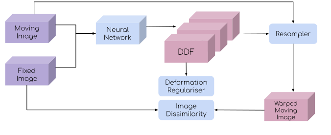

# Summary
Image fusion is a fundamental task in medical image analysis and computer assisted intervetnion. Medical image registration, a class of algorithms to align different images together, has in recent years turned the research attention towards deep learning. Indeed, the representation ability to learn from population data with deep neural networks opened new possibilities for accelerated registration excuation during inerence, improved registration accuracy and more robust generalisation that is less dependent on hand-engineered image features and similarity measures, for feature-based- and intensity-based image registration algorithms, respectively.

`DeepReg` is a Python package that implements a class of image registration algorithms based on deep neural networks. Both unsupervised algorithms [@de2019deep] and weakly-supervised algortihms [@hu2018label] have been implemented. In addition, combining unsupervised losses, such as those derived from image similarity measures, and weak supervision, such as overlap between corresponding anatomical and pathological regions, is at the core of this framework. In this paper, we outline the algorithms and several representative clinical applications, avalibale as 'demos' at the time of writting. An summary of data input and output is also provided to describe the implemented dataset loaders and training data sampling methods. Collectively, we demonstrate the versatility of the package, by providing a wide range of clinical applications as example demonstrations in the `demos` folder.

`DeepReg` is primaily a command line tool that provides basic training and prediction functionaalities, with options and configulations are specified though the command line arguments and/or configuration files in yaml format.

# Algorithms
## Unsupervised learning
Unsupervised learning was first developed independently from a number of research groups, among which, [@de2019deep] demonstrated the applicability in real clinical applications while VoxelMorph [@balakrishnan2019voxelmorph] has contributed to a popular open-source repository for several algorithms tested using brain MR images. Image dissimilarity is measured between the fixed and warped moving images, which has been adapted from the claissical image registration methods. Fig.\autoref{fig:unsupervised} shows a schematic illustration of the network training. Image dissimilarity measures include sum-of-square difference in intensity (SSD), normalised cross-correlation (NCC), mutual information (MI) and their variants.

## Weakly-supervised learning
Weak supervision utilising segmented corresponding regions in the medical image pairs was first proposed in a multimodal application for registering prostate MR to ultrasound images [@hu2018label]. In addition to the regularisation on the predicted displacement field, the training is driven by minimising the dissimilarity between the fixed labels and the warped moving labels, as illustrated in Fig.X. This formulation is modality-independent and similar to many other well-studied computer vision and medical imaging tasks, such as image segmentation. When multiple corresponding label pairs available, a two-stage sampling strategy can be adopted for an unbiased gradient back-propagation during training. Label dissimilarity measures include Dice, jacard, cross entropy and their variants, such as a multiscale Dice.

## Combining unsupervised loss with weak supervision
Combining the unsupervised loss and the weak supervision has shown superior registration accuracy, compared with that using unsupervised loss alone [@balakrishnan2019voxelmorph]. As a result, the overall loss is the weighted sum of the image-, label dissimilarity and deformation regularisation.

## Deformation regularisation and conditional segmentation
The loss functions described in the previous sections are often combined with a deformation regularisation term on the predicted displacement field, in order to ensure the predicted deformation is smooth. The deformation can be regularised by L1-, L2 norms of the displacement gradient and bending energy, based on the first- or second dirivatives of DDF.

The latest result from a different registration formulation challenged the use of deformation regularisation and consequently the necessity of predicting dense displacement field [@hu2019conditional], also implemented in DeepReg.

# Implemetation
## Model
A pair of moving image and fixed image is the input of the network. When available, pairs of moving labels and/or fixed labels can also be the input of the network, regardless of whether they are used to compute the loss. The network predicts a dense displacement field (DDF). Options are also available for the DDF being integrated by a predicted dense velocity field (DFV) or computed from a predicted affine transformation. For conditional segmentation, the network directly predicts warped moving labels [@hu2019conditional].

An encoder-decoder architecture, such as an adapted U-Net and the local-net [@hu2018weakly] is used for dense prediction such as direct DDF or DVF. An encoder-only architecture, such as ResNet and VGG, is used to predict the parameters of an affine (or rigid) transformation model, with 12 (or 6) degrees of freedom.

## Model training
Registration networks are trained using standard minibatch gradient descent, with each minibatch sampling pairs of moving-fixed images and, when available, moving-and-fixed labels.

`DeepReg`, at its first release, provides six predefined dataset loaders for three types of image pairs, unpaired, grouped and paired, each with two dataset loaders depends on whether corresponding labels are avaialble. Random sampling methods are used for unpaired images. For grouped images, group will be sampled before randomly sampling intra-group images for train without biasing to different groups. When multiple labels are avaialble associated with each image, another staged sampling methods are used to draw one pair of labels for each sampled image pair, during each training iteration. Details of the available dataset loaders, how to add cutomised loader and the sampling options are provided in a series of tutorials under the `tutorials` folder.

## The software
The continuous integration platform TravisCI (https://travis-ci.org/) is used together with a cutomised contributor guideline.

# Example applications

## Unpaired images
Unpaired images are found in applications such as single-modality inter-subject registration. Two dataset loaders for unpaired images are implemented, (Case 1-1) UnpairedImages and (Case 1-2) UnpairedLabelledImages.

Neural MR (unsupervised +/- supervision)
3D ultrasound fetal?

## Grouped images
Unpaired images can also be grouped in applications such as single-modality intra-subject registration, in which each subject has multiple images acquired at different time points. Two dataset loaders are implemented, (Case 2-1) GroupedImages and (Case 2-2) GroupedLabelled images.

Lung 4DCT (unsupervised +/- supervision with inter-subject sampling)
Prostate logitudinal MR (unsupervised +/- supervision with inter-subject sampling)

## Paired images
If images are available in pairs, such as two-modality intra-subject registration. Two further dataset loaders are implemneted for (Case 3-1) PairedImages and (Case 3-2) PairedLabelledImages.

Lung 4DCT (unsupervised +/- supervision with inter-subject sampling)
Prostate MR (unsupervised +/- supervision with inter-subject sampling)

# Conclusion
`DeepReg` provides a structured code architecture to facilitate a number of deep learning algorithms to train medical image registration, which provides a reference of basic functionality and performance to further research in medical image analysis and computer assisted intervention. It is in its current open-source format not only providing a tool for scientific research, but also welcoming contributions from wider communities above and betound medical, engineering and computer sicence.

# Acknowledgements

This work is supported by the Wellcome/EPSRC Centre for Interventional and Surgical Sciences (203145Z/16/Z).

# References
<!-- This will be filled in by references in paper.bib -->
