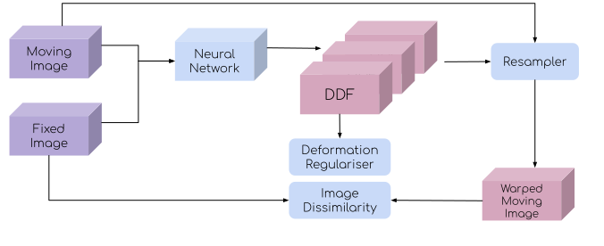
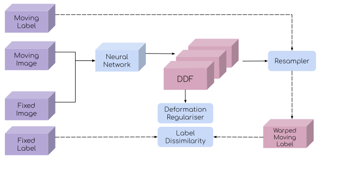
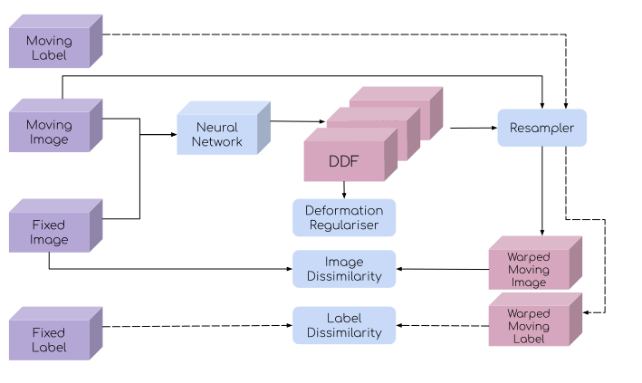

# Image Registration with Deep Learning

A series of scientific tutorials on deep learning for registration can be found at the
[learn2reg tutorial](https://learn2reg.github.io/), held in conjunction with
MICCAI 2019.

This document provides a practical overview for a number of algorithms supported by
DeepReg.

## Registration

Image registration is the process of mapping the coordinate system of one image into
another image. A registration method takes a pair of images as input, denoted as moving
and fixed images. In this tutorial, we register the moving image into the fixed image,
i.e. mapping the coordinates of the moving image onto the fixed image.

## Network

### Predict a dense displacement field

With deep learning, given a pair of moving and fixed images, the registration network
outputs a dense displacement field (DDF) with the same shape as the moving image. Each
value can be considered as the placement of the corresponding pixel / voxel of the
moving image. Therefore, the DDF defines a mapping from the moving image's coordinates
to the fixed image.

In this tutorial, we mainly focus on DDF-based methods.

### Predict a dense velocity field

Another option is to predict a dense (static) velocity field (DVF), such that a
diffeomorphic DDF can be numerically integrated. Read
["A fast diffeomorphic image registration algorithm"](http://citeseerx.ist.psu.edu/viewdoc/download?doi=10.1.1.474.1033&rep=rep1&type=pdf)
and
["Diffeomorphic demons: Efficient non-parametric image registration"](http://www-sop.inria.fr/asclepios/Publications/Tom.Vercauteren/DiffeoDemons-NeuroImage08-Vercauteren.pdf)
for more details.

### Predict an affine transformation

A more constrained option is to predict an affine transformation, parameterised by the
affine transformation matrix of 12 degrees of freedom. The DDF can then be computed to
resample the moving images in fixed image space.

### Predict a region of interest

Instead of outputting the transformation between coordinates, given moving image, fixed
image, and a region of interest (ROI) in the moving image, the network can predict the
ROI in the fixed image directly. Interested readers are referred to the MICCAI 2019
paper:
[Conditional segmentation in lieu of image registration](https://arxiv.org/abs/1907.00438)

## Loss

A loss function has to be defined to train a deep neural network. There are mainly three
types of losses:

### Intensity based (image based) loss

The common loss functions are normalized cross correlation (NCC), sum of squared
distance (SSD), and normalized mutual information (MI).

Intensity based losses measure the dissimilarity between a fixed image and a warped
moving image, which is an adaptation from classical image registration methods. These
losses can perform poorly on multi-modality registrations (e.g. SSD loss in CT-MRI
registration), although certain multi-modality tasks, such as registration between
different MRI sequences are handled well by MI. Generally, intensity based losses work
best when there is an inherent consistency in appearance between moving and fixed
images, which is more common in single-modality registration.

### Feature based (label based) loss

This type of loss measures the dissimilarity of the fixed image labels and warped moving
image labels. The label is often an ROI in the image, like the segmentation of an organ
in a CT image.

The common loss function is Dice loss, Jacard and average cross-entropy over all voxels.

### Deformation loss

This type of loss measures the amount of deformation in an image and penalises
non-smooth deformations . Penalising sudden or discontinuous deformations helps to
regularise the transformation between fixed and moving images.

For DDF, the common loss functions are bending energy, L1 or L2 norm of the displacement
gradient.

## Learning

Depending on the availability of the data labels, registration networks can be trained
with different approaches:

### Unsupervised

When the data label is unavailable, the training can be driven by the unsupervised loss.
The loss function often consists of the intensity based loss and deformation loss. The
following is an illustration of an unsupervised DDF-based registration network.

### Weakly-supervised

When there is no intensity based loss that is appropriate for the image pair one would
like to register, the training can take a pair of corresponding moving and fixed labels
(in addition to the image pair), represented by binary masks, to compute a label
dissimilarity (feature based loss) to drive the registration.

Combined with the regularisation on the predicted displacement field, this forms a
weakly-supervised training. An illustration of an weakly-supervised DDF-based
registration network is provided below.

When multiple labels are available for each image, the labels can be sampled during the
training iteration, such that only one label per image is used in each iteration of the
data set (epoch).

### Combined

When the data label is available, combining intensity based, feature based, and
deformation based losses together has shown superior registration accuracy, compared to
unsupervised and weakly supervised methods. Following is an illustration of a combined
DDF-based registration network.

