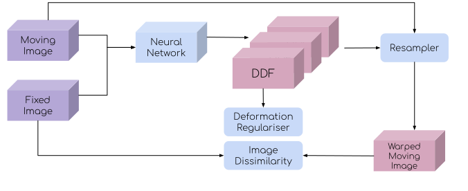
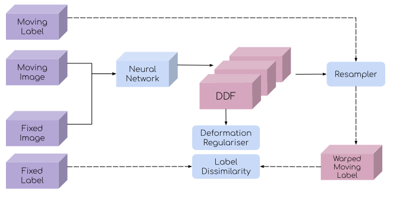
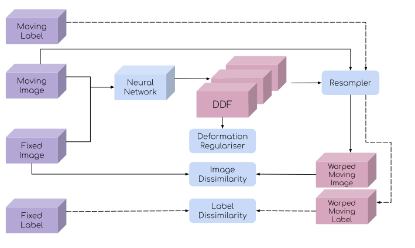

# Get started with image registration using deep learning

A great scientific tutorial on deep learning for registration can be found at the [learn2reg tutorial](https://learn2reg.github.io/), held in conjunction with MICCAI 2019. This tutorial provides a practical overview for a number of algorithms supported by DeepReg.

Registration takes a pair of moving and fixed images as the input of a nerual network, and outputs a dense displacement field (DDF). The DDF can be constrained during training by a deformation regularisation term. The deformation regularisation include, L1- or L2 norm of the displacement gradient and bending energy. The implicite constraint, such as dephmophism can be added by predicting the velocity field then numerically integrated to DDF, a feaature also supported in DeepReg.

## Unsupervised learning
For unsupervised learning, the training is driven by the unsupervised loss. The loss functions are often consisted of a deformation regularisation term on the predicted displacement field and an image dissimilarity measure between the fixed and warped moving images, which are adapted from the claissical image registration methods. The image dissimilarity measures include sum-of-square difference in intensity (SSD), normalised cross correlation (NCC and normalised mutual information (MI). 

## Weakly-supervised learning
The training may take an additional pair of corresponding moving and fixed labels, represented by binary masks, to compute a label dissimilarity to drive the registration.  

In addition to the regularisation on the predicted displacement field, the training is driven by minimising the dissimilarity between the fixed labels and warped moving labels, one that is modality-independent and similar to many other well-studied computer vision and medical imaging tasks, such as image segmentation. 

When multiple labels are available for each image, the labels can be sampled during training iteration, such that on one label with one image is used in each iteration, that is a pair of moving and fixed images and a pair of moving and fixed labels being loaded into training. See more details of the sampling options in [Training data sampling options](./sampling.md)

## Unsupervised learning with weak supervision
Combining the unsupervised loss and the weak supervision has shown superior registration accuracy, compared with that using unsupervised loss alone.

## Conditional segmentation
Depite the name, this formulation to predcit the corresponding regions of interest is considered a image registration, rather than a image segmentation algorithm. Interested readers are refered to the MICCAI 2019 paper:
'Hu, Y., Gibson, E., Barratt, D.C., Emberton, M., Noble, J.A. and Vercauteren, T., 2019, October. Conditional segmentation in lieu of image registration. In International Conference on Medical Image Computing and Computer-Assisted Intervention (pp. 401-409). Springer, Cham.'
[paper link](https://arxiv.org/abs/1907.00438)